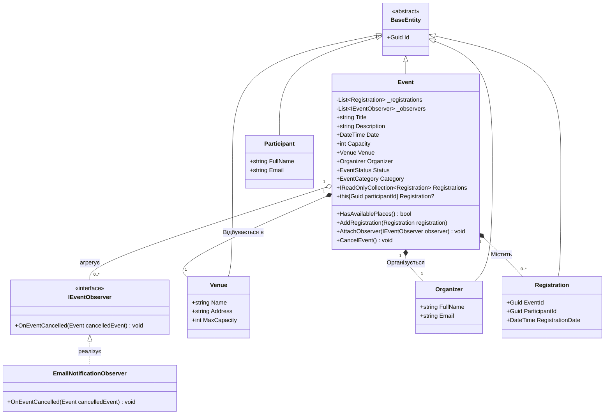

# Система управління подіями (EventManager)

## 1. Анотація (Project Vision)

**EventManager** — це консольна інформаційна система, призначена для автоматизації процесів створення подій, реєстрації учасників та управління ресурсами (локаціями, місткістю). Проєкт розробляється як підсумковий міні-проєкт (Capstone Project) у рамках курсу об'єктно-орієнтованого програмування.

Мета проєкту — демонстрація еволюційного підходу до розробки програмного забезпечення з використанням принципів чистої архітектури, об'єктно-орієнтованого проєктування (SOLID) та патернів проєктування).

### Проблема та рішення

Ручне або неструктуроване управління реєстраціями часто призводить до дублювання учасників, перевищення ліміту місць на локації та втрати консистентності даних. Система EventManager вирішує цю проблему шляхом інкапсуляції строгих бізнес-правил (інваріантів) глибоко в доменному шарі, що унеможливлює переведення системи в некоректний стан.

## 2. Функціональний інкремент Ітерації №2 (Лабораторна робота №35)

У межах поточної ітерації архітектуру системи було розширено такими компонентами:

* **Патерн проектування "Observer":** Реалізовано механізм подій зі слабкою зв'язаністю. При зміні стану доменної сутності `Event` (переведення у статус `Cancelled`) автоматично ініціюється оповіщення підписаних інфраструктурних сервісів (`EmailNotificationObserver`).
* **Модуль бізнес-аналітики (LINQ):** Інтегровано аналітичні декларативні запити у шар прикладних сервісів (`EventService`) для агрегації, групування, фільтрації та сортування доменних даних.
* **Модульне тестування (Unit Testing):** Розроблено тестовий люкс із 15 автоматизованих модульних тестів (xUnit) для верифікації бізнес-правил та інваріантів системи.

## 3. Архітектура рішення

Проєкт побудований за принципами багатошарової архітектури з жорстким дотриманням **Dependency Inversion Principle (DIP)**.

* **1. Domain Layer (`EventManager.Domain`)**: Ядро системи. Містить бізнес-сутності (`Event`, `Venue`, `Organizer`, `Participant`, `Registration`), перелічення, інтерфейси репозиторіїв та інтерфейс `IEventObserver`. Тут реалізовано захист інваріантів (валідація місткості, заборона реєстрації на закриті події). Шар абсолютно незалежний від інших компонентів.
* **2. Application Layer (`EventManager.Application`)**: Шар Use Cases. Відповідає за оркестрацію доменних об'єктів. Використовує патерн `Result` для безпечного повернення результатів операцій. Містить сервіс `EventService` із впровадженням залежностей (DI) та логікою LINQ-аналітики.
* **3. Infrastructure Layer (`EventManager.Infrastructure`)**: Реалізація механізмів збереження даних. Розширено підтримкою асинхронних операцій (`SaveAsync`, `LoadAsync`) для забезпечення інтеграції з файловою системою (JSON-персистентність).
* **4. Presentation Layer (`EventManager.Console`)**: Клієнтський інтерактивний інтерфейс (CLI). Забезпечує маршрутизацію команд та виведення результатів аналітики.

## 4. Доменна модель (UML Class Diagram)

