# Діаграма класів EventManager

## Основні сутності

- BaseEntity
- Event
- Participant
- Registration
- Venue
- Organizer
- RegistrationsManager (internal)
- EventObserversManager (internal)
- EventService
- EmailNotificationObserver
- JsonDataStore<T>
- InMemoryEventRepository
- InMemoryRegistrationRepository

## Перерахування (Enums)

- EventStatus
- EventCategory

## Інтерфейси

- IEventRepository
- IRegistrationRepository
- IEventObserver

## Зв’язки між сутностями

- `Event` пов’язаний з `Venue`
- `Event` пов’язаний з `Organizer`
- `Event` містить `Registration`
- `Registration` пов’язує `Event` та `Participant`
- `Event` агрегує `IEventObserver`
- `EmailNotificationObserver` реалізує `IEventObserver`
- `EventService` залежить від `IEventRepository`, `IRegistrationRepository`, `IEventObserver`
- `InMemoryEventRepository` реалізує `IEventRepository`
- `InMemoryRegistrationRepository` реалізує `IRegistrationRepository`
- `JsonDataStore<T>` додає інфраструктурний рівень для збереження / завантаження даних

- `Event` делегує список реєстрацій в `RegistrationsManager`
- `Event` делегує управління спостерігачами в `EventObserversManager`
- `EventObserversManager` викликає `IEventObserver.OnEventCancelled` при скасуванні

## Межі шарів

Console -> Application -> Domain -> Infrastructure

```mermaid
classDiagram
    class BaseEntity {
        <<abstract>>
        +Guid Id
    }

    class IEventObserver {
        <<interface>>
        +OnEventCancelled(Event cancelledEvent) void
    }

    class IEventRepository {
        <<interface>>
        +Add(Event eventItem) void
        +GetById(Guid id) Event?
        +GetAll() List~Event~
        +SaveAsync() Task
        +LoadAsync() Task
        +AddAsync(Event eventItem) Task
        +GetByIdAsync(Guid id) Task~Event?~
        +GetAllAsync() Task~List~Event~~~
    }

    class IRegistrationRepository {
        <<interface>>
        +Add(Registration registration) void
        +GetAll() List~Registration~
    }

    class Event {
        -RegistrationsManager _registrations
        -EventObserversManager _observers
        +string Title
        +string Description
        +DateTime Date
        +int Capacity
        +Venue Venue
        +Organizer Organizer
        +EventStatus Status
        +EventCategory Category
        +IReadOnlyCollection~Registration~ Registrations
        +HasAvailablePlaces() bool
        +AddRegistration(Registration registration) void
        +AttachObserver(IEventObserver observer) void
        +CancelEvent() void
    }

    class Venue {
        +string Name
        +string Address
        +int MaxCapacity
    }

    class Organizer {
        +string FullName
        +string Email
    }

    class Participant {
        +string FullName
        +string Email
    }

    class Registration {
        +Guid EventId
        +Guid ParticipantId
        +DateTime RegistrationDate
    }

    class EmailNotificationObserver {
        +OnEventCancelled(Event cancelledEvent) void
    }

    class RegistrationsManager {
        -List~Registration~ _registrations
        +IReadOnlyCollection~Registration~ AsReadOnly()
        +List~Registration~ InternalList
        +HasAvailablePlaces(int capacity) bool
        +IsAlreadyRegistered(Guid participantId) bool
        +Add(Registration registration) void
    }

    class EventObserversManager {
        -List~IEventObserver~ _observers
        +Attach(IEventObserver observer) void
        +NotifyCancelled(Event ev) void
    }

    class EventService {
        -IEventRepository _repository
        -IRegistrationRepository? _registrationRepository
        -IEventObserver? _observer
        +CreateEventAsync(Event eventEntity) Task~Result~
        +CreateEvent(...) Result
        +LoadDataAsync() Task
        +GetAllEvents() List~Event~
        +RegisterParticipant(Guid eventId, string name, string email) Result
        +CancelEvent(Guid eventId) Result
        +SaveDataAsync() Task
        +GetAvailableEvents() List~Event~
        +GetTopPopularEvents(int topN) List~Event~
        +GetTotalCapacityOfOpenEvents() int
        +GetEventCountByCategory() Dictionary~EventCategory,int~
    }

    class InMemoryEventRepository {
        +Add(Event eventItem) void
        +GetById(Guid id) Event?
        +GetAll() List~Event~
        +SaveAsync() Task
        +LoadAsync() Task
        +AddAsync(Event eventItem) Task
        +GetByIdAsync(Guid id) Task~Event?~
        +GetAllAsync() Task~List~Event~~~
    }

    class InMemoryRegistrationRepository {
        +Add(Registration registration) void
        +GetAll() List~Registration~
    }

    class JsonDataStore~T~ {
        +LoadAsync() Task~Result~List~T~~~
        +SaveAsync(List~T~ data) Task~Result~
    }

    BaseEntity <|-- Event
    BaseEntity <|-- Venue
    BaseEntity <|-- Organizer
    BaseEntity <|-- Participant
    BaseEntity <|-- Registration

    IEventObserver <|.. EmailNotificationObserver : implements
    IEventRepository <|.. InMemoryEventRepository : implements
    IRegistrationRepository <|.. InMemoryRegistrationRepository : implements
    IEventRepository <|.. EventService : depends
    IRegistrationRepository <|.. EventService : depends
    IEventObserver <|.. EventService : depends

    Event "1" *-- "1" Venue : has
    Event "1" *-- "1" Organizer : has
    Event "1" *-- "0..*" Registration : contains
    Event "1" *-- "1" RegistrationsManager : delegates
    Event "1" o-- "1" EventObserversManager : delegates
    Event "1" o-- "0..*" IEventObserver : attaches
    Registration "*" --> "1" Participant : refers
    Registration "*" --> "1" Event : refers
```

